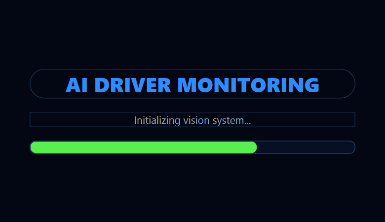
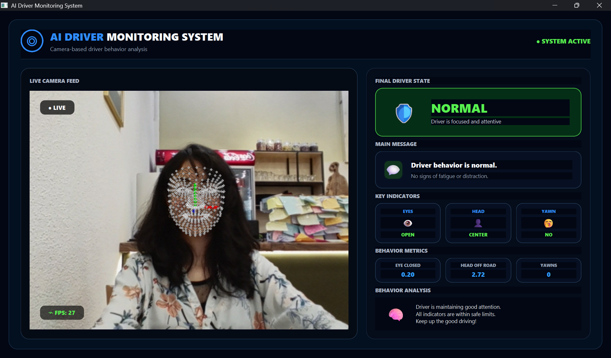
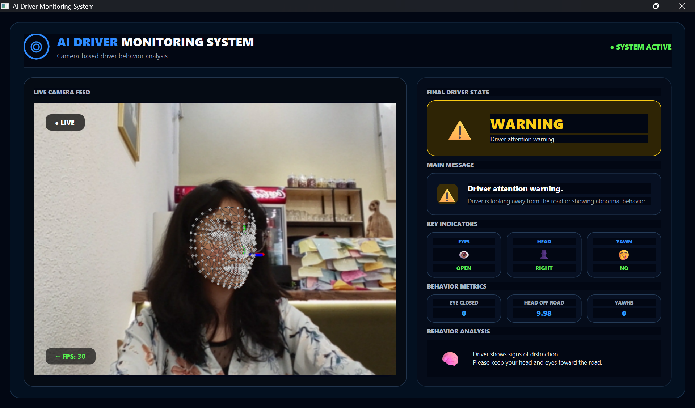
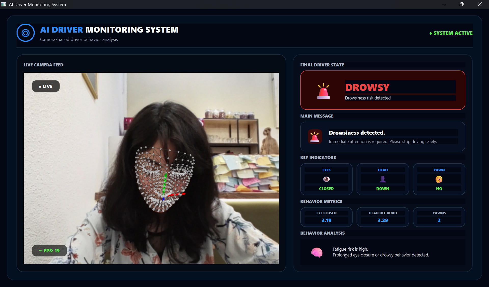
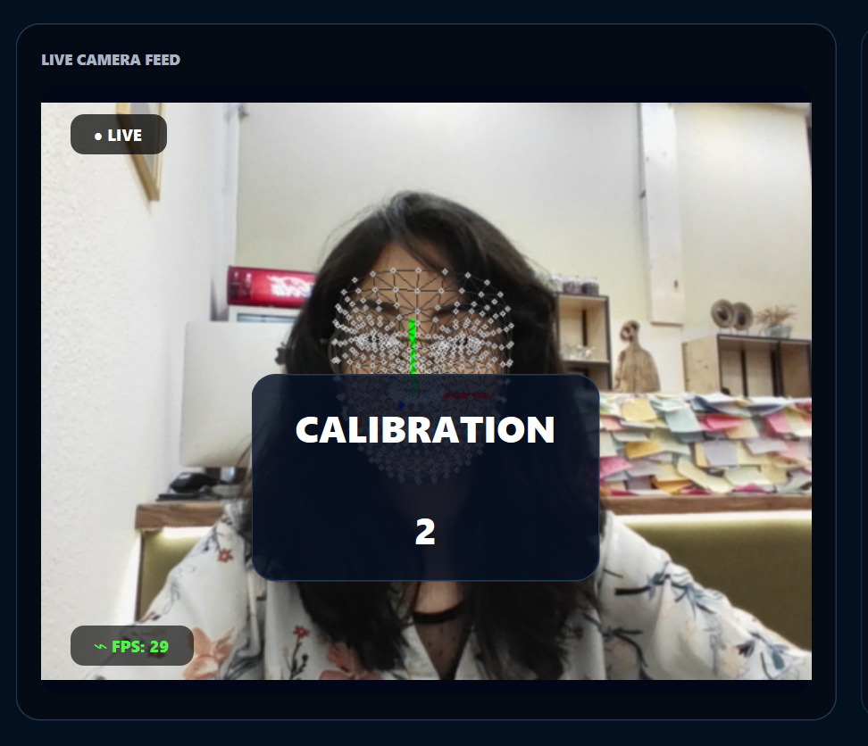

# 🚗 AI Driver Monitoring System

A real-time desktop application for driver behavior monitoring using
Computer Vision and MediaPipe.

Built with Python, OpenCV, MediaPipe and PySide6.

### initializing

### Normal state

### Warning State

### Drowsy Alert

### Calibration

✅ Face Mesh Detection

✅ Head Pose Estimation

✅ Head Direction Classification

✅ Eye Blink Detection

✅ Yawn Detection

✅ Driver Behavior Analysis

✅ Drowsiness Detection

✅ Real-Time Desktop Dashboard

✅ Audio Alert

✅ FPS Counter

✅ Calibration System
_____________________________________________

### Demo

DriverMonitoring.exe

or

Youtube video: 
https://youtu.be/ISinZsZHW3I?si=114cvfCdMzIzBFZq

or

python app.py

_____________________________________________

### System Architecture

Camera

↓

Face Mesh

↓

Head Pose

↓

Eye Tracking

↓

Yawn Detection

↓

Driver Behavior Engine

↓

Desktop Dashboard

_____________________________________________

### Technologies

Python

OpenCV

MediaPipe

NumPy

PySide6

PyInstaller

_____________________________________________

### Project Structure

driver_monitoring/

assets/

modules/

ui/

app.py

README.md

_____________________________________________

### Installation

git clone ...

pip install -r requirements.txt

python app.py

_____________________________________________

### Future Work

Phone Detection

Seat Belt Detection

Driver Identification

Deep Learning Models (detecting)

Cloud Dashboard

_____________________________________________

### Author

**Roza BostanPira**

GitHub: https://github.com/rosebp85

email:  rosebpira@gmail.com

---

## ⭐ If you like this project

Please consider giving it a star ⭐ on GitHub.

Feedback and contributions are always welcome.
